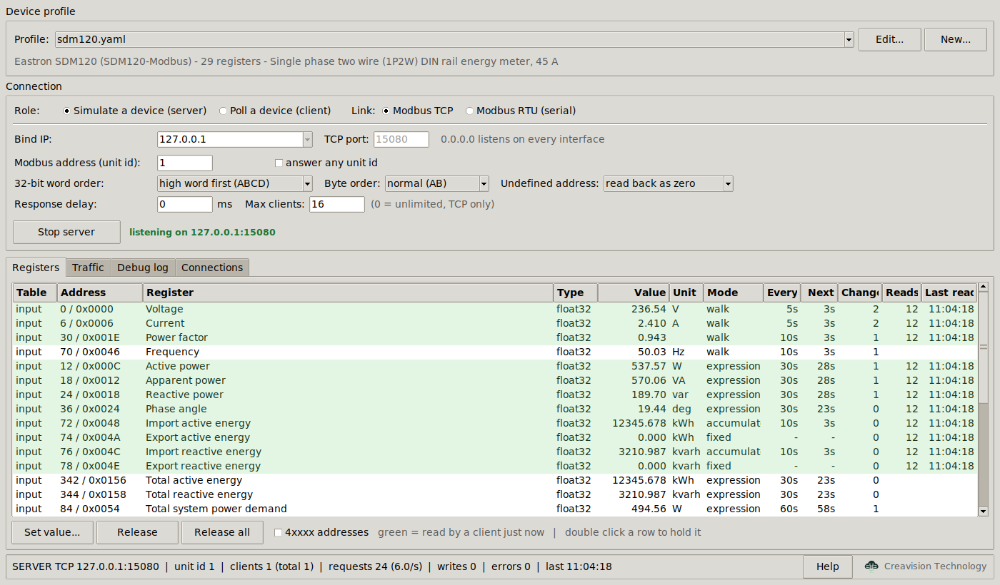
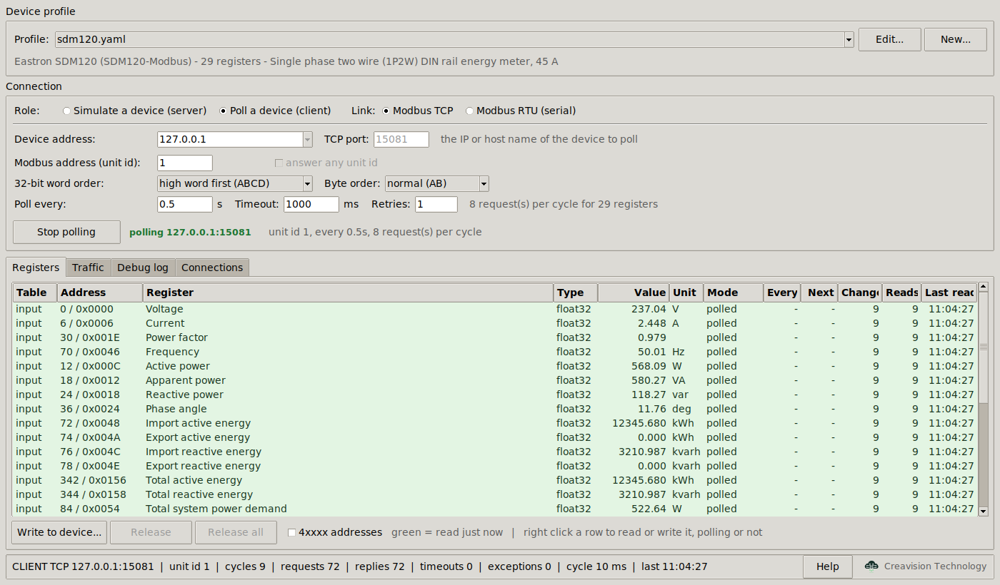
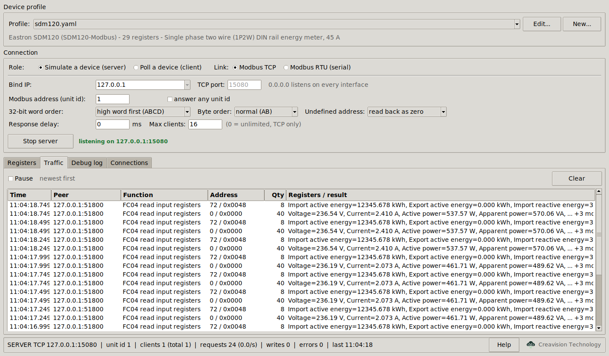
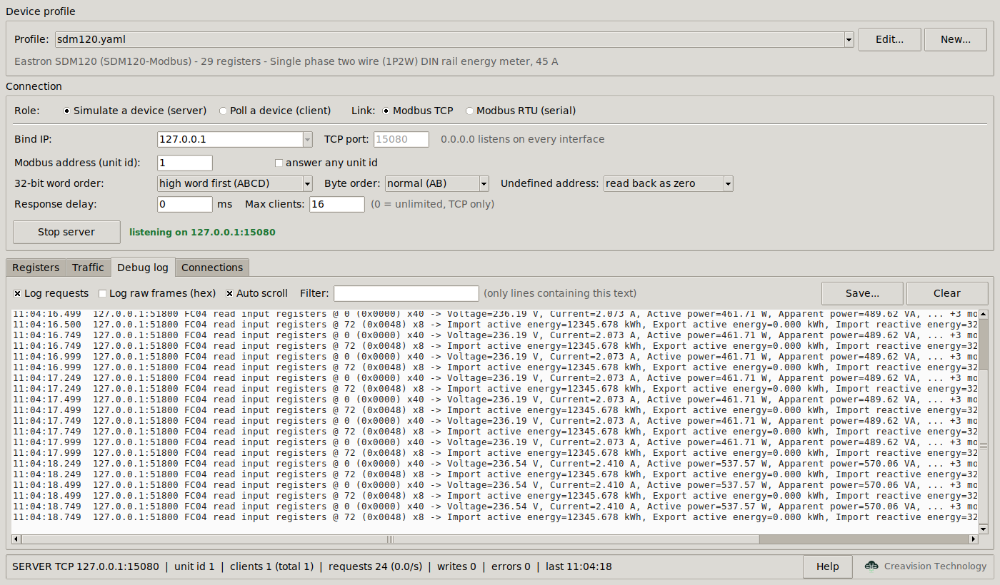
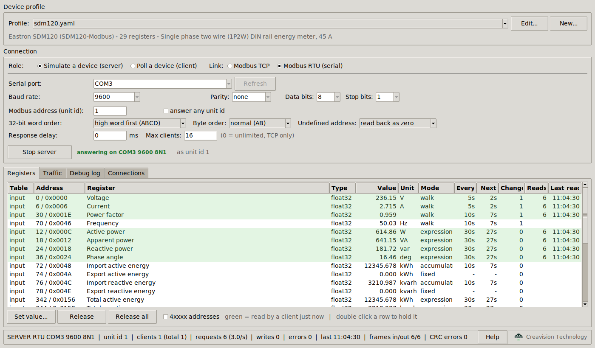
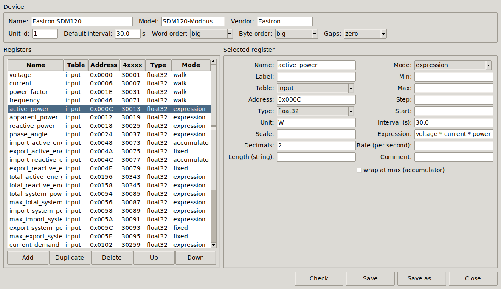
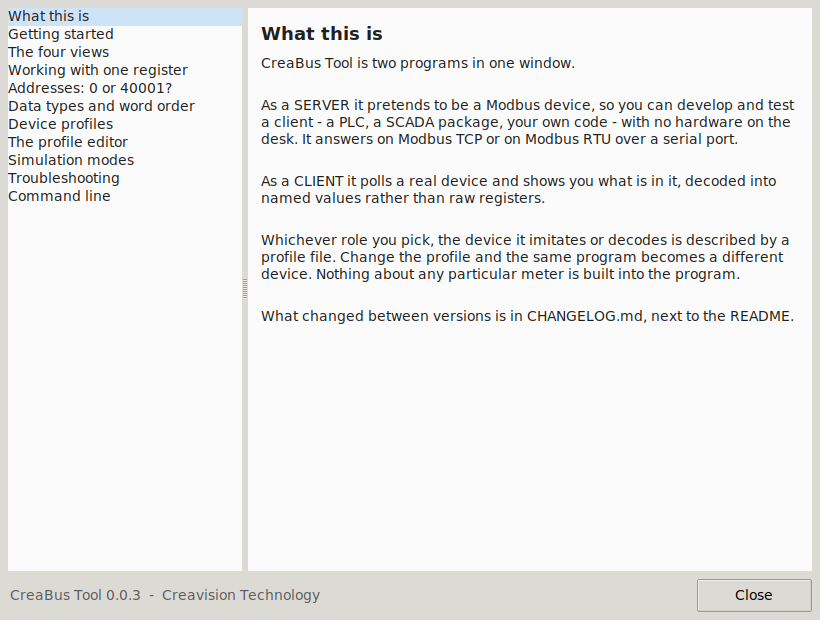

<div align="center">


# CreaBus Tool

**A Modbus simulator and client in one window — TCP and RTU, server and client.**

[](https://github.com/CreavisionTechnology/creabus-tool/actions/workflows/build.yml)
[](LICENSE)
[](https://www.python.org/)

<sub>by [Creavision Technology](https://creavisiontechnology.com)</sub>

</div>

---

CreaBus Tool works four ways from one window:

| | **Modbus TCP** | **Modbus RTU (serial)** |
| --- | --- | --- |
| **Server** — pretend to be a device | listen on a socket | answer on RS-485 / a USB adapter |
| **Client** — poll a real device | over the network | over RS-485 / a USB adapter |

Out of the box it is an **Eastron SDM120** energy meter with plausible,
self-consistent dummy data. What it pretends to be lives entirely in a profile
file under [`devices/`](devices) — edit that file, or pick a different one in
the UI, and the same program becomes a different device. The same profile also
tells the **client** how to decode a real device, so pointing it at hardware
gives you named, scaled, correctly typed values instead of raw registers.

Runs on Windows, Linux and macOS. Standalone executables need no Python at all.



## Contents

- [Install and run](#install-and-run)
- [The command line](#the-command-line)
- [Settings](#settings)
- [Seeing what is happening](#seeing-what-is-happening)
- [Working with one register](#working-with-one-register)
- [Making it a different device](#making-it-a-different-device)
- [The profile editor](#the-profile-editor)
- [Protocol coverage](#protocol-coverage)
- [Building it yourself](#building-it-yourself)
- [Checking it works](#checking-it-works)
- [Layout](#layout)
- [Notes and troubleshooting](#notes-and-troubleshooting)
- [Licence](#licence)
- [Changelog](CHANGELOG.md)
- [Contributing](#contributing)
- [About Creavision Technology](#about-creavision-technology)

---

## Install and run

### Option 1 — a released executable (nothing to install)

Download the build for your platform from the
[releases page](https://github.com/CreavisionTechnology/creabus-tool/releases),
unzip it, and run it.

| platform | what you get |
| --- | --- |
| Windows | `creabus-tool.exe` (the window) and `creabus-tool-cli.exe` (for `--headless` and scripting) |
| macOS | `creabus-tool.app` (double click) and `creabus-tool` (terminal) |
| Linux | `creabus-tool` (window or `--headless`) |

Every archive also carries a `HOW-TO-RUN.txt` saying which of its files is the
one to open.

Windows is the only platform that genuinely needs two executables: a program
has to choose between having a console and having a window when it is linked,
so it is built both ways. `creabus-tool.exe` is the window and never flashes a
black box; `creabus-tool-cli.exe` is the one that can print, be piped and take
`Ctrl+C`. Run the `-cli` one with no arguments and it prints its help — add
`--ui` if you want the window from it. On macOS the `.app` and the bare
`creabus-tool` binary are the same program; macOS just needs a bundle to double
click and a plain file to type.

The device profiles are inside the executable and are copied to a `devices`
folder next to it the first time it runs, so they stay editable.

macOS quarantines an unsigned app that arrived over the internet. To clear it:

```bash
xattr -dr com.apple.quarantine /path/to/creabus-tool.app
```

### Option 2 — from source

Needs **Python 3.9 or newer**, and **Tcl/Tk 8.6 or newer** for the window.

```bash
git clone https://github.com/CreavisionTechnology/creabus-tool.git
cd creabus-tool

python3 -m venv .venv          # see the macOS note below for which python3
source .venv/bin/activate      # Windows: .venv\Scripts\activate

pip install -r requirements.txt
python main.py
```

The virtual environment is worth the two extra lines. Inside it, plain
`python` and `pip` are the ones this project needs, so nothing depends on
which `python3` your shell happens to find, and nothing is installed
system-wide. Homebrew and most Linux distributions now refuse
`pip install` outside one anyway (`error: externally-managed-environment`,
[PEP 668](https://peps.python.org/pep-0668/)) — a venv is the answer to that,
not `--break-system-packages`.

Each new terminal needs `source .venv/bin/activate` again; `deactivate`
leaves it. `.venv/` is already in `.gitignore`.

Both dependencies are optional, and the program tells you if it needs one:

* **PyYAML** reads the `.yaml` device profiles. Convert a profile to `.json`
  and the app runs on the standard library alone.
* **pyserial** is only needed for Modbus RTU. TCP works without it.

Tk for the window, if your Python has none:

```bash
sudo apt install python3-tk          # Debian, Ubuntu
sudo dnf install python3-tkinter     # Fedora
brew install python-tk               # macOS
```

> **macOS: do not use the built-in `/usr/bin/python3` for the window.** It
> links against Apple's system Tcl/Tk, which is still 8.5.9 and stopped
> drawing this kind of window at macOS 10.15 — you get an empty one. The tool
> detects that and says so rather than showing you a blank rectangle.
>
> Apple's Python cannot be repaired: installing a newer Tk does not change
> which one it links against. Build the venv with a **different** Python,
> named by version:
>
> ```bash
> brew install python@3.13 python-tk@3.13
>
> # confirm before you build anything - this must not say 8.5
> /opt/homebrew/bin/python3.13 -c 'import tkinter; print(tkinter.TkVersion)'
>
> /opt/homebrew/bin/python3.13 -m venv .venv
> source .venv/bin/activate
> pip install -r requirements.txt
> python main.py
> ```
>
> The full path is deliberate: plain `python3` is Apple's unless
> `/opt/homebrew/bin` comes first in your `PATH` (`which -a python3` shows the
> order). Once the venv exists it inherits the interpreter you built it with,
> so from then on `python` inside it is the right one.
>
> A [python.org](https://www.python.org/downloads/macos/) installer works the
> same way — build the venv with `python3.13`, not `python3`. Or just open
> `creabus-tool.app` from the release, which carries its own Tk. `--headless`
> works on any Python.

`python main.py --version` prints the Python and Tk actually in use, and says
if the Tk is too old.

## The command line

```bash
# server (pretend to be a device)
python main.py                                        # UI, SDM120 over TCP
python main.py --headless --port 5020                 # no UI
python main.py --link rtu --serial-port COM3 --baud 9600 --headless
python main.py --link rtu --serial-port /dev/ttyUSB0 --baud 9600 --parity even

# client (poll a real device)
python main.py --role client --host 192.168.1.50 --port 502
python main.py --role client --link rtu --serial-port /dev/ttyUSB0 --headless

# find your way around
python main.py --list          # device profiles
python main.py --ports         # serial ports on this machine
python main.py --help
```

Replace `python main.py` with `./creabus-tool` (or `creabus-tool-cli.exe`) when
you are using a released binary — every flag is the same. `creabus-tool-cli.exe`
with no arguments prints its help rather than opening the window; `--ui` opens
it.

| flag | meaning |
| --- | --- |
| `-r, --role` | `server` (pretend to be a device) or `client` (poll one) |
| `-l, --link` | `tcp` or `rtu` |
| `-H, --host` | server: address to bind. client: the device to poll |
| `-p, --port` | TCP port (default 502) |
| `-s, --serial-port` | serial port for RTU, e.g. `COM3`, `/dev/ttyUSB0` |
| `-b, --baud` | baud rate (default 9600) |
| `--parity` `--databits` `--stopbits` | the rest of the line settings |
| `-u, --unit` | Modbus address (unit id) |
| `--any-unit` | server: answer whatever unit id is asked for |
| `--word-order` | `big` = high word first (ABCD), `little` = low word first (CDAB) |
| `--byte-order` | byte order inside each 16 bit word |
| `--gap-policy` | server: `zero` or `exception` for undefined addresses |
| `--delay` | server: response delay in ms, to simulate a slow device |
| `--max-clients` | server: refuse connections beyond this many (TCP) |
| `--poll-interval` | client: seconds between poll cycles |
| `--timeout` `--retries` | client: reply timeout in ms, retries per request |
| `-d, --device` | device profile to load |
| `--headless` | no UI, log to stdout |
| `--start` | UI mode: start straight away |
| `--log-frames` | log every raw frame as hex |
| `--quiet` | do not log individual requests |

## Settings

**Device profile** — the dropdown lists every file in `devices/`, and re-reads
the folder every time you open it: a file you have just copied in is there,
and one you have edited outside the window is reloaded, without pressing
anything. Switching profiles restarts whatever was running. **Edit...** and
**New...** open the built-in editor. *Profile → Open devices folder* shows you
where `devices/` actually is, which is the thing to know before copying a file
into it.

**Connection** — role and link at the top, then everything that link needs:

| setting | applies to | what it does |
| --- | --- | --- |
| **Bind IP / Device address** | TCP | server: which interface to listen on (`0.0.0.0` = all). client: the IP or host name to poll |
| **TCP port** | TCP | 502 is the default; 5020 is the usual alternative when 502 is taken or needs root |
| **Serial port** | RTU | detected ports with their descriptions; **Refresh** rescans, and you can type a name |
| **Baud rate, Parity, Data bits, Stop bits** | RTU | the line settings, which must match the other end exactly |
| **Modbus address (unit id)** | both | the slave address, 0-255 |
| **answer any unit id** | server | reply to every address instead of rejecting the others |
| **32-bit word order** | both | how a `float32`/`int32` spans two registers: *high word first (ABCD)* (Eastron, most PLCs) or *low word first (CDAB)* (many inverters). Get it wrong and floats are nonsense — flip it and everything is re-encoded instantly |
| **Byte order** | both | byte order inside each 16 bit word |
| **Undefined address** | server | *read back as zero* (so block reads spanning gaps work) or *exception 0x02* |
| **Response delay** | server | milliseconds before answering, to test client timeouts |
| **Max clients** | server, TCP | connections beyond this are refused and logged |
| **Poll every / Timeout / Retries** | client | how often to poll, how long to wait, how many times to retry |

Only the endpoint itself — bind address, port, serial settings — needs stopping
first. Everything else, including the Modbus address and the word order,
applies to the running link the moment you change it, and says so in the log.

## Seeing what is happening

Four views, all live, in both roles.

**Registers** — every register with its value, address in decimal and hex,
type, and **how many times it has been read and when**. A row turns **green**
while it is being read, so you can see at a glance which part of the map is
being polled and which registers are never touched. As a server it also shows
the simulation mode, update interval and countdown to the next change; as a
client every row says `polled`.

Double click a row: as a server that **holds** the register at a value you
choose (amber, until **Release**); as a client it **writes** the value to the
real device.



**Traffic** — one row per request, newest first: time, peer, function code,
address, quantity, and the values that went back. Writes amber, exceptions
red, **Pause** to freeze it.



**Debug log** — the same events as running text, colour coded: connections
green, disconnections grey, requests black with the registers decoded next to
them, exceptions red. *Log raw frames (hex)* adds the bytes on the wire — for
RTU that is the actual frame including the CRC. **Filter** narrows it,
**Save...** writes it to a file.



**Connections** — as a server, who is connected, since when, how many requests
and errors, and what they last asked for. As a client, the state of the one
link. On a serial bus there is only ever one peer, shown as the bus master.

The status bar carries the whole picture: endpoint, unit id, clients, request
rate, writes, errors, and for RTU the frame counts and CRC error count.



## Working with one register

Right click any row in the Registers table for the actions that apply to it.

| polling a device | |
| --- | --- |
| **Read now** | fetch just this register, now |
| **Write to device...** | write a value, if the table allows writing |

| simulating a device | |
| --- | --- |
| **Hold at value...** | freeze it at a value you choose, ignoring the simulation |
| **Release** | hand it back to the simulation |

Either role can copy the address, the 4xxxx address, the value, or the whole
row as a tab separated line to paste into a spreadsheet. Double clicking a row
reads it, or — on a register a client may write, and on anything at all when
simulating — offers to set it.

**Neither Read now nor Write needs polling to be running.** If nothing is
connected, the tool opens a connection for that one request and closes it
again, so checking a single value on a meter is a right click and nothing
else. If polling *is* running the same link is reused, because a second
connection to one device is wrong on TCP and impossible on an RS-485 bus.
Either way the request goes out off the UI thread, so a device that has
stopped answering costs you a log line rather than a frozen window.

### Addresses: 0 or 40001?

Modbus carries a zero based address on the wire. Device manuals almost always
print a different number for the same register — one based, with a digit in
front saying which table it lives in:

| table | manual | on the wire |
| --- | --- | --- |
| coils | 1, 2, 3 … | 0, 1, 2 … |
| discrete inputs | 10001, 10002 … | 0, 1 … |
| input registers | 30001, 30002 … | 0, 1 … |
| holding registers | 40001, 40002 … | 0, 1 … |

So "40001" in a manual and "holding register 0" on the wire are the same
register, and mixing the two up is the most common reason a value comes back
from the wrong place. Tick **4xxxx addresses** under the Registers table (or
View ▸ 4xxxx / 3xxxx addresses) to switch the Address column between them.
It is a display choice and changes nothing else.

The five digit form has only four digits for the address, so it runs out at
`49999` — protocol address 9998. Registers above that use the six digit form,
and so does this tool, at the same boundary:

| protocol address | shown as |
| --- | --- |
| holding 9998 | `49999` — the last five digit address |
| holding 9999 | `410000` — six digits from here on |
| holding 0xFC00 | `464513` — the SDM120's serial number |

## Making it a different device

Everything the program knows about a device is in one file. Copy
[`devices/_template.yaml`](devices/_template.yaml) — it uses every option once,
with comments — and describe your own registers:

```yaml
device:
  name: "My inverter"
  unit_id: 1
  default_interval: 30      # seconds between value changes, unless overridden
  word_order: big           # big = high word first; little = "CDAB" devices
  gap_policy: zero          # undefined addresses read as 0 (or reply 0x02)

registers:
  - name: dc_voltage
    label: "DC voltage"
    table: input            # input | holding | coil | discrete
    address: 0x0064
    type: float32
    unit: V
    mode: walk              # random walk, so the value moves believably
    min: 320.0
    max: 480.0
    step: 4.0
    interval: 5             # this register changes every 5s, not every 30s
    decimals: 1
```

Save it in `devices/` and pick it from the dropdown — opening the dropdown
re-reads the folder, so it is already listed.

[`devices/README.md`](devices/README.md) is the full schema reference. In short:

* **Types** — `float32` `float64` `int16` `uint16` `int32` `uint32` `int64`
  `uint64` `bool` `string`, plus `scale` for devices that put e.g. tenths of a
  volt in an integer register.
* **Modes** — `walk` (random walk within the limits), `random`, `fixed`,
  `expression` (computed from the other registers) and `accumulator` (a counter
  integrating a rate, for energy totals).
* **Timing** — `default_interval` at device level, `interval` per register.

`expression` is what keeps the dummy data believable rather than merely random.
In the SDM120 profile only voltage, current, power factor and frequency are
generated; active power is `voltage * current * power_factor`, apparent power
is `voltage * current`, reactive power is
`sqrt(apparent_power**2 - active_power**2)`, and the energy registers integrate
the power. A client reading the meter sees a physically consistent device.

As a **client** the same profile is the decoding table, and the registers it
declares are grouped into as few requests as the protocol allows — the 29
SDM120 registers are read in 8 requests per cycle, not 29.

## The profile editor

Editing the YAML by hand is still the quickest way to make a big change, but
working out a register map against real hardware goes faster in the window:
**Profile ▸ Edit…**, or the **Edit…** button next to the profile dropdown.



Add, duplicate, reorder and delete registers on the left; every field of the
selected one is on the right, grouped into what the register *is* (name, table,
address, type, unit, scale) and how its value *behaves* (mode, limits, interval,
expression). The 4xxxx column updates as you type an address, so you can check
it against a manual without converting in your head.

**Check** validates without writing anything. **Save** and **Save as…** run the
same validation first, so a profile that saves is a profile that opens — you
cannot write a file the loader would reject. Saving a profile that is currently
loaded reloads it immediately.

**Profile ▸ New…** starts from a blank device with one register.

Nothing is written until you save, and the editor works on a copy: closing it
leaves a running server exactly as it was.

## Help

**Help ▸ CreaBus Tool help**, the **Help** button, or **F1**. It covers the two
roles, the four views, addressing, data types and word order, profiles, the
simulation modes, and a troubleshooting list for the failures that actually
happen — wrong unit id, wrong word order, exception 0x02, serial permissions.



### Included profiles

| file | device | where the map comes from |
| --- | --- | --- |
| `devices/sdm120.yaml` | Eastron SDM120, single phase, 29 registers | the SDM120 manual |
| `devices/sdm630.yaml` | Eastron SDM630, three phase, 45 registers | the SDM630 manual |
| `devices/sunspec-inverter.yaml` | Three phase PV inverter, ~10 kW | SunSpec models 1 + 103 |
| `devices/sunspec-meter.yaml` | Three phase revenue meter | SunSpec models 1 + 203 |
| `devices/plc-io.yaml` | PLC / remote I/O rack, all four tables | generic |
| `devices/vfd-drive.yaml` | Variable frequency drive | generic |
| `devices/climate-sensor.yaml` | RS-485 temperature / humidity / CO2 sensor | generic |
| `devices/_template.yaml` | commented tour of every option | — |

**Read this before pointing one at real hardware.** A profile is only as good
as the map it was written from, and these come from three different places:

*From a manufacturer's manual.* The two Eastron profiles. The SDM120 input
register map (function 04, 32 bit floats, high word first) is the well
documented part; a few **holding** addresses differ between firmware
revisions, so check the manual that came with your meter.

*From an open specification.* The two SunSpec profiles implement models
published by the [SunSpec Alliance](https://sunspec.org), not any one
vendor's map — which is what makes them a reasonable first guess at an
unknown inverter, since a large share of grid-tied inverters offer a SunSpec
interface alongside their native one. Check the base address before anything
else: a manual saying "40001" means protocol address **40000** on the wire,
and 50001 or 1 are equally legal. Then walk the model chain from the `SunS`
marker to see which models your device actually implements.

*Generic, and named that way.* `plc-io`, `vfd-drive` and `climate-sensor` are
not any manufacturer's product and do not pretend to be — no two vendors
number a drive the same way, so a map claiming otherwise would be worse than
none. They exist to exercise a client against a realistic device shape:
`plc-io` uses all four tables and both bit functions, `vfd-drive` has the
control-word / status-word pattern every drive shares, and `climate-sensor`
is the smallest realistic device here and the classic "everything reads 10x
too big" trap.

None of these is a substitute for your device's manual. Copy the closest one,
fix the addresses from the manual, and you have a working profile.

## Protocol coverage

| code | function |
| --- | --- |
| `0x01` / `0x02` | read coils / discrete inputs |
| `0x03` / `0x04` | read holding / input registers |
| `0x05` / `0x06` | write single coil / register |
| `0x0F` / `0x10` | write multiple coils / registers |
| `0x11` | report server id (returns the device name) |

Anything else replies with exception `0x01`. Quantity limits (125 registers per
read, 123 per write, 2000 bits) are enforced with exception `0x03`, and writes
are validated across the whole range before any of it is applied, so a rejected
write changes nothing.

**TCP**: a request for a unit id this device does not answer on gets exception
`0x0B`, so a misconfigured client fails immediately instead of timing out.

**RTU**: framing follows the standard rules — a frame ends after 3.5 character
times of silence, and the CRC is checked on every frame. Because waiting for
silence on every frame is slow, the receiver works the length out from the
function code where it can and keeps the silence rule as the fall back and as
the resynchronisation rule after a bad CRC. A request addressed to another
slave is met with **silence**, not an exception, so the reply cannot collide
with that slave's; a broadcast (address 0) is acted on and never answered.

## Building it yourself

You only need this if you want your own standalone executables — most people
should just download a release.

```bash
pip install -r requirements.txt -r requirements-dev.txt
python build.py
```

The result lands in `dist/`. Options:

| command | what it does |
| --- | --- |
| `python build.py` | everything this platform needs |
| `python build.py --clean` | throw away `build/` and `dist/` first |
| `python build.py --gui-only` | just the double click app |
| `python build.py --cli-only` | just the command line binary |
| `python build.py --dir` | a folder instead of one file (starts faster) |

**PyInstaller cannot cross compile**, so run it on each platform you want a
build for: on Windows for a `.exe`, on macOS for a `.app`, on Linux for an ELF
binary. A Linux binary is also glibc dependent — build on the oldest
distribution you intend to support.

That is what CI is for.
[`.github/workflows/build.yml`](.github/workflows/build.yml) runs the tests and
builds Windows, Linux, Intel macOS and Apple silicon macOS on every push. To
cut a release, push a tag — that is the whole procedure:

```bash
git tag -a v0.0.1 -m "CreaBus Tool 0.0.1"
git push origin v0.0.1
```

The workflow then builds all four platforms, refuses to publish if any of them
is missing, and creates the GitHub release with a zip per platform attached.
The version itself lives in one place, `VERSION` in
[`creabus_tool/branding.py`](creabus_tool/branding.py); the tag should match it.

The build embeds the Python runtime and Tk into the executable, which is why it
is around 12 MB and needs nothing installed on the target machine. See
[THIRD-PARTY-NOTICES.md](THIRD-PARTY-NOTICES.md) for what that includes and
under which licences.

## Checking it works

```bash
python tools/selftest.py          # the device and the protocol
python tools/selftest_links.py    # RTU framing and the client, over a loopback
python tools/uitest.py            # the real window, in all four modes
python tools/editortest.py        # the profile editor, register menu and help
```

`selftest_links.py` runs Modbus RTU end to end over an in-memory "cable", so it
needs no serial hardware: CRC vectors, frame length prediction, wrong-slave
silence, broadcast, CRC resynchronisation, then a full client-server loop over
both transports.

On a headless Linux machine the two UI tests need a virtual display:
`xvfb-run -a python tools/uitest.py`.

```bash
python tools/read_meter.py --host 127.0.0.1 --port 5020
python tools/read_meter.py --host 127.0.0.1 --port 5020 --watch 2
python tools/read_meter.py --raw input 0 20
```

A dependency-free Modbus TCP client that reads every register of a profile and
prints it decoded. `--raw` dumps a register range word by word.

The screenshots in this README are generated, not taken by hand, so they never
carry anything from anyone's desktop:

```bash
xvfb-run -a python tools/screenshots.py    # needs imagemagick
```

## Layout

```
main.py                   entry point, argument parsing, headless modes
build.py                  builds the standalone executables
creabus_tool/pdu.py        function codes, exceptions, CRC, frame length rules
creabus_tool/profile.py    device profile loading and validation
creabus_tool/datastore.py  registers, encoding, the simulation engine
creabus_tool/server.py     the server role: request handling, TCP and RTU endpoints
creabus_tool/client.py     the client role: masters, request planning, the poller
creabus_tool/rtu.py        serial framing, port enumeration, the test loopback
creabus_tool/compat.py     the handful of real Windows / Linux / macOS differences
creabus_tool/branding.py   name, version, icon and the About box
creabus_tool/editor.py     the device profile editor
creabus_tool/help.py       the help window and its text
creabus_tool/ui.py         the Tkinter control panel
assets/                   the logo, in SVG and as PNG/ICO/ICNS
CHANGELOG.md              what changed in each version
devices/                  device profiles
docs/                     the screenshots in this file
tools/                    test client, the self tests, the screenshot and icon scripts
```

`assets/` is generated from `assets/creabus-tool-logo.svg` by
`python tools/make_assets.py` (needs `cairosvg` and `pillow`), so the icons
committed here are reproducible rather than mysterious binaries.

## Notes and troubleshooting

**The window opens empty (macOS, run from source).** Apple's
`/usr/bin/python3` links against the system Tcl/Tk, which is still 8.5.9 and
stopped drawing this kind of window at macOS 10.15. CreaBus Tool detects it and
tells you rather than showing a blank rectangle. Use a Python with its own Tk
(`brew install python-tk`, or an installer from
[python.org](https://www.python.org/downloads/macos/)), or open
`creabus-tool.app` from the release, which carries a working Tk. `--headless`
is unaffected. `--version` prints the Tk in use.

**Two executables.** Windows builds ship `creabus-tool.exe` (the window) and
`creabus-tool-cli.exe` (the console). They are the same program built twice,
because Windows makes a program choose one or the other at link time. macOS
ships a `.app` to double click and a bare binary to type — also the same
program. Each archive's `HOW-TO-RUN.txt` says which is which.

**Serial ports.** On Linux the port usually belongs to the `dialout` group:
`sudo usermod -a -G dialout $USER`, then log back in. On macOS use the
`/dev/cu.*` name for a client rather than `/dev/tty.*`. On Windows a port can
only be open once, so close any other terminal program first.

**Low ports.** Binding 502 needs root on Linux and macOS. Use 5020, or run with
`sudo`.

**Floats look like nonsense.** The word order is wrong. Flip **32-bit word
order** between *high word first (ABCD)* and *low word first (CDAB)* — the
values are re-encoded immediately, no restart needed.

**Expressions are checked, not trusted.** `expression` and `rate` carry code,
and profiles get shared — off a forum, from a colleague, through a pull
request. So an expression is parsed and vetted against an allowlist of syntax
*before anything runs*: arithmetic, comparisons, a conditional and calls to a
fixed list of maths functions. Attribute access is not on the list, which is
what closes the usual escape (`().__class__.__base__.__subclasses__()` walks
out to every loaded class, and it needs a `.` to start). A profile that steps
outside the allowlist is refused when it loads, so it never reaches the
simulation. See [`creabus_tool/expressions.py`](creabus_tool/expressions.py)
and [SECURITY.md](SECURITY.md); `tools/selftest.py` tries that escape and
thirteen others on every CI run.

## Licence

CreaBus Tool is free software under the
[GNU General Public License, version 3 or later](LICENSE).

You may run it for anything you like, privately or commercially, with no fee
and nothing to report. You may read the source, change it, and share your
changes. **If you distribute it, or anything built from it, you must do so
under the GPL and make the source available** — that is the one real
condition, and it is what keeps this version free for the people who rely on
it.

**No warranty, and that matters here more than for most software.** This tool
writes to industrial equipment. A write goes to whatever device answers on the
address you gave it, and a wrong register on a live panel can trip a plant,
move a motor or lose a meter's configuration. It is supplied *as is*, with no
warranty of any kind, and neither Creavision Technology nor any contributor
accepts liability for what it does on your system — sections 15 and 16 of the
GPL, and they are meant literally. Check the unit id and the address before
you write, and prove a profile against a bench device before you take it to a
live one.

### CreaBus Tool Pro

Creavision Technology also sells **CreaBus Tool Pro**, which is not under the
GPL. The free version is not a demo and is not time limited: it is the whole
tool, and it stays that way.

This is why contributions are covered by a [contributor licence
agreement](CLA.md) — you keep your copyright, your work stays in the free
version, and Creavision may also use it in the paid one. It is stated up
front rather than in the small print. See [CONTRIBUTING.md](CONTRIBUTING.md).

### Provenance

Every line in this repository was written for this project. No code was copied
from another Modbus implementation, and no third party source is vendored here
— the protocol itself is a published specification, and constants like function
codes and the CRC-16 polynomial are facts of that specification rather than
anyone's copyrighted expression.

The dependencies and the components embedded in the release binaries carry
their own licences, all of them compatible with the GPL.
[THIRD-PARTY-NOTICES.md](THIRD-PARTY-NOTICES.md) lists every one.

**Trademarks.** *Modbus* is a registered trademark of Schneider Electric USA,
Inc., used here only descriptively, to say which protocol this software
speaks. *Eastron*, *SDM120* and *SDM630* are marks of their respective owners.
*SunSpec* is a trademark of the SunSpec Alliance, whose specifications the two
SunSpec profiles implement; those profiles are this project's own work and are
neither produced nor certified by the Alliance. This project is not affiliated
with, endorsed by or sponsored by any of them.

The CreaBus Tool logo is original artwork for this project and is not based on
any existing mark. *CreaBus*, *CreaBus Tool* and *Creavision Technology* are
marks of Creavision Technology: the GPL covers the code, not the use of the
company's name, product names or logo to endorse or promote your own version.
If you distribute a modified version, please give it a different name.

## Contributing

Issues and pull requests are welcome — see [CONTRIBUTING.md](CONTRIBUTING.md).
The short version: run the three self tests before you open a PR, sign off
your commits with `git commit -s`, and read [CLA.md](CLA.md) first — you keep
your copyright, and Creavision may also use your work in CreaBus Tool Pro.

## About Creavision Technology

CreaBus Tool is built and maintained by **Creavision Technology**, an embedded
systems and industrial connectivity consultancy —
[creavisiontechnology.com](https://creavisiontechnology.com).

We wrote this because we needed it: a Modbus endpoint we could point at real
hardware and trust. It is free software under the GPL, and it stays that way.
If it saves you an afternoon, that is the point. If you need something similar
for your own devices, or a hand with a protocol that is misbehaving, we are
[reachable](https://creavisiontechnology.com).

---

<div align="center">
<sub>Made by <a href="https://creavisiontechnology.com"><b>Creavision Technology</b></a></sub>
</div>
